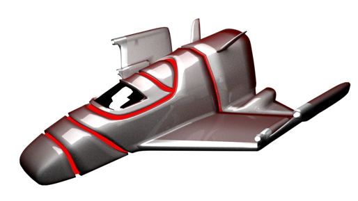
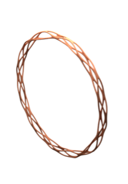
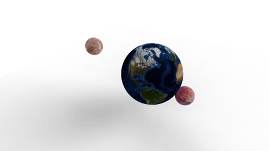
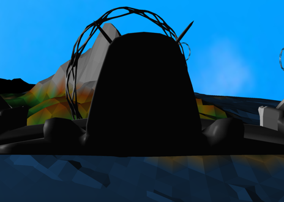
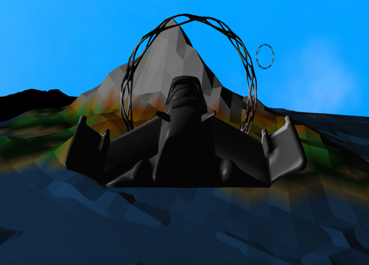
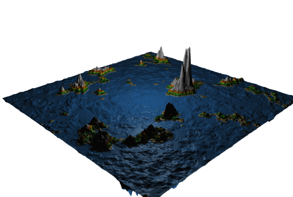
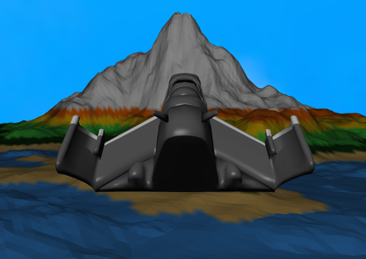
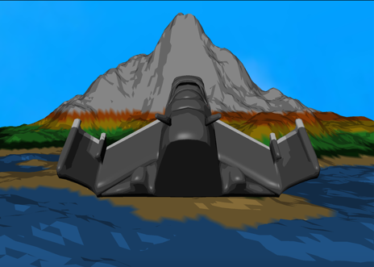

# Grand Theft Space
IN4152-FinalProject

This is the final project for the course IN4152 Computer Graphics at TU Delft. It is a 3D spaceship video game. Everything was coded from scratch using OpenGL in C++, this includes: the procedurally generated terrain and obstacles, the texture mapping, the shading, the shadows, and the navigation controls. Additionally, the spaceship and some elements of the landscape were modeled in Blender. Some screenshots of the game are added below. 

### Modeled elements

### Cameras 

First person camera:

Third person camera:

### Procedurally generated terrain

### Shading

Phong:

Toon:

